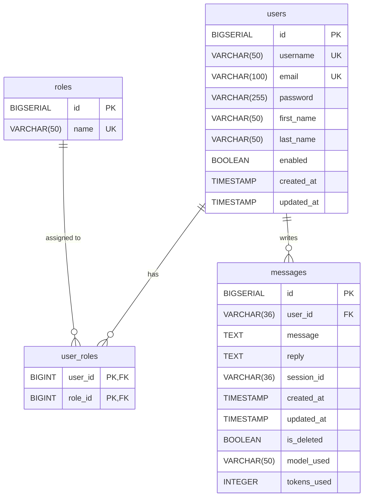

# 🚂 РЖД Помощник — AI-ассистент для пассажиров

> **Виртуальный голосовой помощник для пассажиров РЖД на основе локальной LLM (Ollama) с поддержкой регистрации, авторизации и хранения истории диалогов.**


---

## 📋 О проекте

**РЖД Помощник** — это полнофункциональный веб-сервис, который предоставляет пользователям интеллектуального ассистента для получения информации о:

- Расписании поездов
- Покупке и возврате билетов
- Статусе поездов в реальном времени
- Программе лояльности «РЖД Бонус»

Проект построен на современном стеке технологий и полностью готов к запуску в production-среде.

### 🎯 Ключевые возможности

| Возможность | Описание |
|-------------|----------|
| 🤖 **Умный чат** | Общение с AI-ассистентом на основе локальной LLM (Ollama) |
| 🎤 **Голосовой ввод** | Поддержка голосового ввода через Web Speech API |
| 🔐 **Регистрация и авторизация** | Полноценная система аутентификации с Spring Security |
| 💾 **История диалогов** | Сохранение всех сообщений в PostgreSQL |
| 📱 **Адаптивный интерфейс** | Работает на ПК, планшетах и мобильных устройствах |
| 🐳 **Docker Ready** | Запуск в один клик через Docker Compose |

---

## 🧠 Технологический стек

### Бэкенд

| Технология | Версия | Назначение |
|------------|--------|------------|
| **Spring Boot** | 4.0.0 | Основной фреймворк |
| **Spring Security** | 7.0.0 | Аутентификация и авторизация |
| **Spring Data JPA** | — | ORM для работы с БД |
| **PostgreSQL** | 16 | Хранение данных |
| **Lombok** | — | Упрощение кода |

### Фронтенд

| Технология | Описание |
|------------|----------|
| **HTML5** | Структура страниц |
| **CSS3** | Адаптивный дизайн в стиле РЖД |
| **JavaScript (ES6+)** | Логика интерфейса |
| **Tabler Icons** | Иконки |
| **Web Speech API** | Голосовой ввод |

### Инфраструктура

| Технология | Назначение |
|------------|------------|
| **Ollama** | Локальная LLM (llama3.2:3b) |
| **Docker / Docker Compose** | Контейнеризация |
| **Maven** | Сборка проекта |
| **Git** | Контроль версий |

---
```plaintext
📁 AI-assistant/
│
├── 📁 .github/
│   └── 📁 workflows/
│       └── 📄 ci.yml
│
├── 📄 init-db.sql
│
├── 📁 src/
│   └── 📁 main/
│       ├── 📁 java/
│       │   └── 📁 ru/
│       │       └── 📁 superchack/
│       │           ├── 📄 ApplicationRunner.java
│       │           │
│       │           ├── 📁 config/
│       │           │   ├── 📄 AppConfig.java
│       │           │   └── 📄 SecurityConfig.java
│       │           │
│       │           ├── 📁 controller/
│       │           │   ├── 📄 AuthController.java
│       │           │   ├── 📄 ChatController.java
│       │           │   └── 📄 HistoryController.java
│       │           │
│       │           ├── 📁 dto/
│       │           │   ├── 📁 Chatdto/
│       │           │   │   ├── 📄 ChatRequest.java
│       │           │   │   ├── 📄 ChatResponse.java
│       │           │   │   └── 📄 ChatHistoryResponse.java
│       │           │   └── 📁 Ollamadto/
│       │           │       ├── 📄 OllamaRequest.java
│       │           │       └── 📄 OllamaResponse.java
│       │           │
│       │           ├── 📁 exception/
│       │           │   ├── 📄 ApiException.java
│       │           │   └── 📄 GlobalExceptionHandler.java
│       │           │
│       │           ├── 📁 model/
│       │           │   └── 📄 Message.java
│       │           │
│       │           ├── 📁 repository/
│       │           │   └── 📄 MessageRepository.java
│       │           │
│       │           ├── 📁 security/
│       │           │   ├── 📁 dto/
│       │           │   │   ├── 📄 AuthRequest.java
│       │           │   │   └── 📄 AuthResponse.java
│       │           │   ├── 📁 model/
│       │           │   │   ├── 📄 User.java
│       │           │   │   └── 📄 Role.java
│       │           │   ├── 📁 repository/
│       │           │   │   ├── 📄 UserRepository.java
│       │           │   │   └── 📄 RoleRepository.java
│       │           │   └── 📁 service/
│       │           │       ├── 📄 UserDetailsServiceImpl.java
│       │           │       └── 📄 AuthService.java
│       │           │
│       │           └── 📁 service/
│       │               ├── 📄 OllamaService.java
│       │               └── 📄 ChatHistoryService.java
│       │
│       └── 📁 resources/
│           ├── 📄 application.yml
│           └── 📁 static/
│               ├── 📄 index.html
│               ├── 📁 css/
│               │   └── 📄 style.css
│               ├── 📁 js/
│               │   ├── 📄 app.js
│               │   ├── 📄 chat.js
│               │   └── 📄 voice.js
│               └── 📁 partials/
│                   ├── 📄 navbar.html
│                   ├── 📄 hero.html
│                   ├── 📄 features.html
│                   ├── 📄 news.html
│                   ├── 📄 footer.html
│                   ├── 📄 page-chat.html
│                   └── 📄 modals.html
│
├── 📄 docker-compose.yml
├── 📄 pom.xml
└── 📄 README.md
```

---

## 🔧 API Эндпоинты

### Аутентификация

| Метод | URL | Тело | Ответ | Описание |
|-------|-----|------|-------|----------|
| POST | `/api/auth/register` | `{"username": "string", "email": "string", "password": "string"}` | `{"username": "...", "email": "...", "message": "..."}` | Регистрация нового пользователя |
| POST | `/api/auth/login` | `{"username": "string", "password": "string"}` | `{"username": "...", "email": "...", "message": "..."}` | Вход в систему (по email или username) |

### Чат

| Метод | URL | Тело | Ответ | Описание |
|-------|-----|------|-------|----------|
| POST | `/api/chat` | `{"message": "string"}` | `{"reply": "string"}` | Отправить сообщение AI-ассистенту |
| GET | `/api/history/{userId}` | — | `[{"id": 1, "message": "...", "reply": "...", "createdAt": "..."}]` | Получить историю сообщений |

---

## 🚀 Быстрый старт

### Требования

| Компонент | Версия | Скачать |
|-----------|--------|---------|
| Java | 21+ | [Eclipse Temurin](https://adoptium.net/) |
| Docker | 24+ | [Docker Desktop](https://www.docker.com/) |
| Maven | 3.9+ | Встроен в IDEA |
| Git | 2.40+ | [Git](https://git-scm.com/) |

🗄️ База данных
Схема таблиц(ER-Модель)

📄 Лицензия
Проект разработан в рамках учебно-исследовательской работы.
Для промышленного использования в РЖД требуется дополнительная сертификация.

👤 Автор
@xxGonzalesxx

GitHub: github.com/xxGonzalesxx

Email: stef.kir1999@gmail.com

⭐ Если проект вам понравился, поставьте звезду!
https://img.shields.io/github/stars/xxGonzalesxx/AI-assistant.svg?style=social

📞 Контакты
По всем вопросам: stef.kir1999@gmail.com
